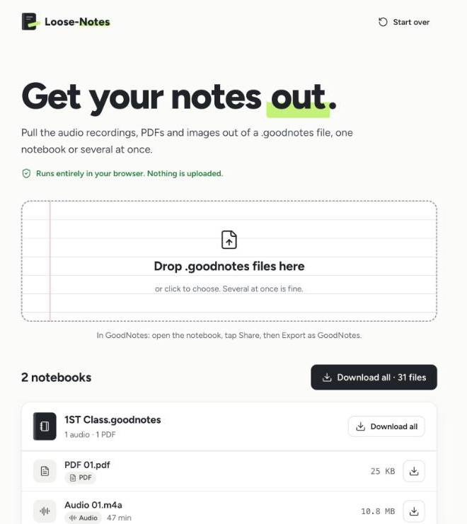

# Loose-Notes

**Live: [loosenotes.thitichotk.com](https://loosenotes.thitichotk.com)**

Loose-Notes pulls the audio recordings, PDFs and images out of `.goodnotes` files. Drop in one notebook or several and
you get back what's inside, grouped by notebook, ready to download one by one or as a zip. It all runs in your browser:
nothing is uploaded.



## Using it

1. In GoodNotes, open the notebook, tap **Share**, then **Export** as **GoodNotes**.
2. Drop the `.goodnotes` file onto the page, or click to choose it. You can add several at once.
3. Click a file's name to preview it (images and recordings open in place; PDFs open in a new tab), use the download
   button on the row, or press **Download all** for one zip.

## What comes out

| In the notebook | Saved as | How it's recognised |
|---|---|---|
| Recordings | `Audio 01.m4a` | `ftyp` box at byte 4 (GoodNotes records M4A) |
| Imported PDFs | `PDF 01.pdf` | `%PDF` |
| Photos and pasted images | `Image 01.jpg` / `.png` / `.heic` / `.gif` / `.webp` | file signature |

GoodNotes stores attachments without names or extensions, so Loose-Notes reads each file's first bytes to work out
what it is. Files are numbered per type, oldest first by the date stored with each attachment. Attachments under 10 KB are
skipped, because those are GoodNotes' own page templates and icons. Downloads keep the notebook's name in front
(`Biology Lecture 4 - Audio 01.m4a`), Thai names included.

## Run it locally

It's a static page; any web server will do (ES modules don't load from `file://`).

```bash
git clone https://github.com/thitichotk/loose-notes.git
cd loose-notes
python3 -m http.server 8000      # then open http://localhost:8000
node check.mjs                   # checks the file-signature table
```

| File | Role |
|---|---|
| `index.html` | The page, plus the inlined icon set |
| `script.js` | Reading notebooks with JSZip, rendering, preview, downloads and zips |
| `detect.js` | File-signature table (`kindOf`) |
| `styles.css` | The Loose-Notes design system: graphite on paper, ruled-paper drop zone, green highlighter |
| `check.mjs` | One `node` check for `detect.js` |

Cloudflare Pages deploys the `main` branch as it is (there's no build step), and each pull request gets a preview link.

## Limits

- The whole notebook is read into memory, so very large notebooks (several hundred MB) can be too much for a phone
  browser. A computer handles them better.
- HEIC photos download fine but only preview in Safari.

## Credits and license

Loose-Notes is a fork of [alinuxpengui/goodnotes-extractor](https://github.com/alinuxpengui/goodnotes-extractor),
redesigned and largely rewritten by Thitichot K. Zip handling by [JSZip](https://github.com/Stuk/jszip), icons from
[Lucide](https://lucide.dev) (ISC).

Licensed under the [GNU General Public License v3.0](LICENSE), like the original.

- Copyright (C) 2025 alinuxpengui (original goodnotes-extractor)
- Copyright (C) 2025–2026 Thitichot K. (modified: new interface, M4A/HEIC detection, per-notebook grouping, zip
  downloads, drag and drop)

Not affiliated with GoodNotes or Time Base Technology Limited.
